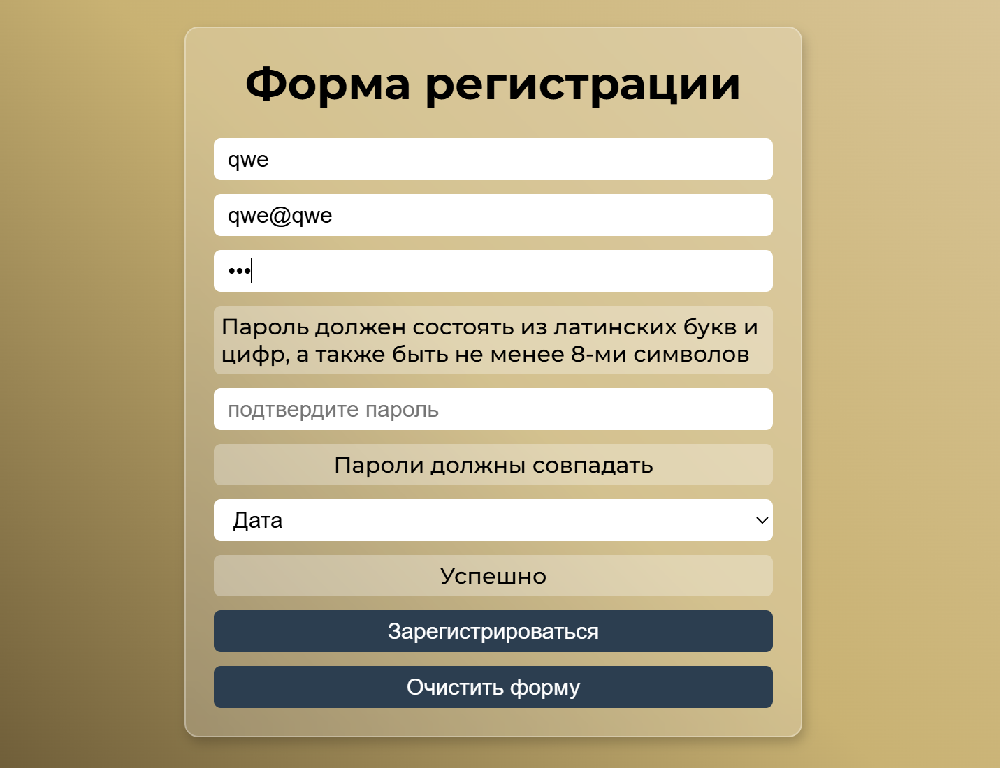

# 📝 React Registration Form

Профессиональная форма регистрации с валидацией на React

<div align="center">


_Интерфейс_

</div>

## 🎯 О проекте

Полнофункциональная форма регистрации с комплексной валидацией данных, разработанная на современном React. Проект демонстрирует лучшие практики работы с формами, включая разделение логики валидации, управление состоянием и пользовательский опыт.

## ✨ Ключевые возможности

### ✅ Валидация данных

- **Пароль**: латинские буквы + цифры, минимум 8 символов
- **Совпадение паролей**: проверка идентичности пароля и подтверждения
- **Обязательные поля**: все поля должны быть заполнены
- **Email**: встроенная браузерная валидация

### 🎯 Пользовательский опыт

- **Инлайн-валидация**: мгновенная проверка при вводе
- **Визуальная обратная связь**: сообщения об ошибках и успехе
- **Очистка формы**: сброс всех полей одной кнопкой
- **Динамический год**: выпадающий список с годами

## 🛠 Технологии

- **React 18+** - хуки состояния и функциональные компоненты
- **CSS Modules** - стилизация формы
- **Валидаторы** - отдельный модуль для бизнес-логики
- **Регулярные выражения** - проверка сложности пароля

## 📁 Архитектура проекта

```
src/
├── components/
│   └── RegForm.jsx           # Основной компонент формы
├── utils/
│   └── validators.js         # Функции валидации
├── styles/
│   └── RegForm.css          # Стили формы
└── README.md
```

## 🚀 Быстрый старт

### Валидационные правила:

- **Имя**: обязательное поле
- **Email**: обязательное поле + браузерная валидация
- **Пароль**: минимум 8 символов, буквы + цифры
- **Подтверждение пароля**: должно совпадать с паролем
- **Год рождения**: обязательный выбор

### Управление состоянием:

```javascript
const [password, setPassword] = useState("");
const [isPasswordValid, setIsPasswordValid] = useState(true);
const [passwordMatch, setPasswordMatch] = useState(true);
```

### Инлайн-валидация:

```javascript
const handlePasswordChange = (event) => {
  const newPassword = event.target.value;
  setPassword(newPassword);
  setIsPasswordValid(validatePassword(newPassword)); // Мгновенная проверка
  setPasswordMatch(checkPasswordMatch(newPassword, confirmPassword));
};
```

### Обработка отправки:

```javascript
const handleSubmit = (event) => {
  event.preventDefault();

  const allFieldsFilled = checkFieldsFilled([
    /* поля */
  ]);
  const isFormValid = allFieldsFilled && isPasswordValid && passwordMatch;

  if (!isFormValid) {
    setRequiredFieldsError(true);
    return;
  }

  // Отправка данных...
};
```

### Разделение ответственности:

- ✅ **Компоненты** - только отображение и взаимодействие
- ✅ **Валидаторы** - чистая бизнес-логика
- ✅ **Стили** - изолированное оформление

